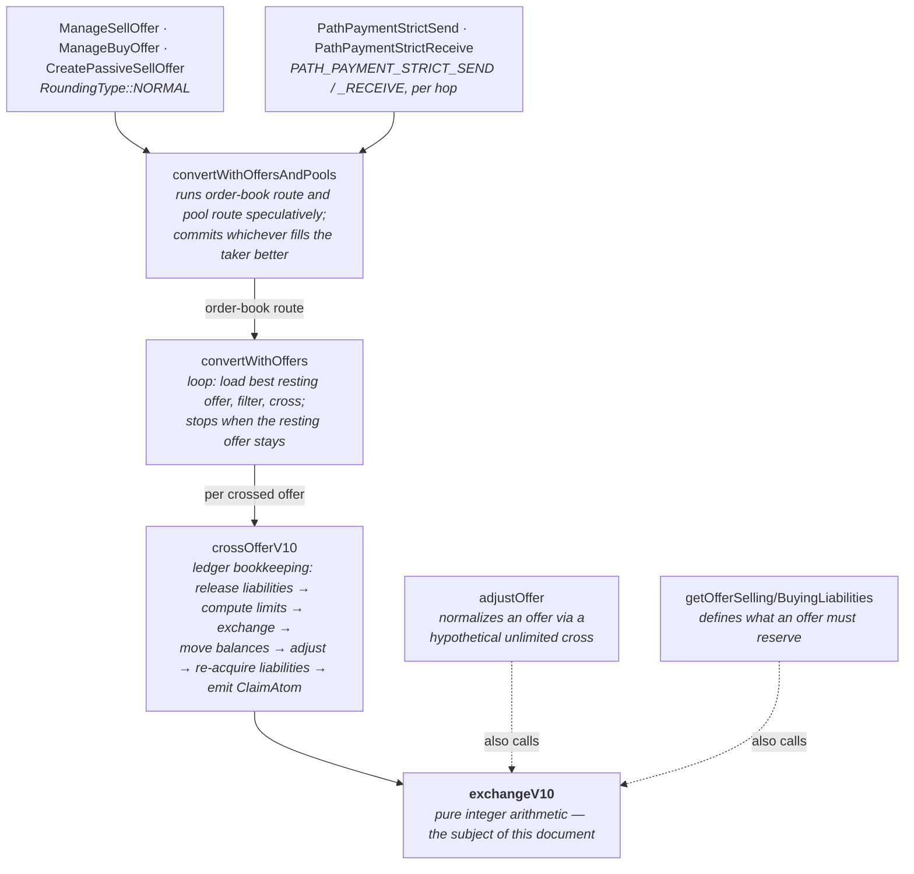

# The SDEX offer lifecycle and `exchangeV10`

What the matching engine's arithmetic core is, the properties it is supposed to
satisfy, the concrete scenarios that make each property necessary — including
one property that protocol 28 violates — and the ledger lifecycle around the
arithmetic: how an offer is posted, what it reserves, and what happens when it
is crossed.

*Scope: stellar-core, transactions subsystem, protocol ≥ 10. Code references
are to `src/transactions/` in this repository, at the revision you have checked
out. The catalogue describes the arithmetic before protocol 29; protocol 29
repairs P9 (see `exact-cap-liability-semantics.md`), and `formal/RESULTS.md`
gives the status of the modeled properties at both protocols.*

## Contents

1. [The SDEX in brief](#1--the-sdex-in-brief)
2. [Where exchangeV10 sits](#2--where-exchangev10-sits)
3. [What it computes](#3--what-it-computes)
4. [The property catalog (P1–P10)](#4--the-property-catalog)
5. [The known failure: an offer inconsistent with its own reservation](#5--the-known-failure-an-offer-inconsistent-with-its-own-reservation)
6. [The offer lifecycle at the ledger level](#6--the-offer-lifecycle-at-the-ledger-level)
7. [Consequences for the formal model](#7--consequences-for-the-formal-model)

## 1 · The SDEX in brief

The Stellar decentralized exchange (SDEX) is an **on-ledger central limit
order book**. Offers are ledger entries; matching is not performed by an
off-chain engine but re-executed by every validator as part of applying a
transaction. This forces three unusual constraints on the matching arithmetic:

- **Bit-exact determinism.** Every validator must compute the identical
  result, or the network forks. No floating point, no platform-dependent
  behavior, no failure modes that depend on local state.
- **Integer-only quantities.** All amounts are `int64_t` stroops (10⁻⁷ of an
  asset unit). Prices are exact rationals `n/d` with `int32_t` components —
  never evaluated as a quotient, only used in cross-multiplications.
- **Rounding must be adjudicated.** Crossing two offers at a rational price
  generally requires a division that does not come out even. Someone must win
  each remainder, and the assignment has to be principled, or it becomes an
  extraction mechanism.

The book stores only *sell* offers. A newly submitted offer is a *limit*
order — it crosses anything at its price or better — but once resting in the
book an offer is *exact*: it trades at precisely the price written on it. When
two offers cross, **the resting offer's price governs**. Buy-side semantics
(`ManageBuyOffer`, CAP-6) are implemented by conversion to sell offers. Since
CAP-38, each trade also considers a constant-product liquidity pool and takes
whichever venue gives the taker the better deal.

The historical layering: CAP-3 introduced *liabilities* (reservations that
keep every resting offer fully executable), CAP-4 redesigned crossing to
control rounding, both shipped in protocol 10 — hence `exchangeV10`. The
function is two halves of one design with the liability system, which is why
several properties below tie the two together.

## 2 · Where exchangeV10 sits



The code speaks in a fixed metaphor: the **resting (book) offer sells wheat
and buys sheep**; the taker sells sheep. The price `n/d` is sheep-per-wheat.
Four limits enter, two per side:

| argument          | imposed by | meaning |
|-------------------|------------|---------|
| `maxWheatSend`    | maker      | offer amount ∧ seller's spendable wheat (`canSellAtMost`: balance − reserves − selling liabilities) |
| `maxSheepReceive` | maker      | seller's sheep headroom (`canBuyAtMost`: limit − balance − buying liabilities) |
| `maxWheatReceive` | taker      | how much wheat the taker still wants / can accept |
| `maxSheepSend`    | taker      | how much sheep the taker can still pay |

**One function, three roles.** Keep these separate when reading the
properties:

1. **Trade execution** — `crossOfferV10` uses the result to move real
   balances.
2. **Offer normalization** — `adjustOffer(price, amt, headroom)` = the wheat
   side of a hypothetical cross against an unlimited counterparty; it shrinks
   an offer to what its owner can actually deliver. Every offer entering or
   remaining in the book passes through it.
3. **Reservation definition** — an offer's liabilities *are defined as* the
   outcome of its own unlimited cross: selling liability
   `SL = f_sell(price, A)` (= `A` for adjusted offers), buying liability
   `BL = f_buy(price, A) = ⌊A·n/d⌋`.

Role 3 feeding back into roles 1–2 — the reservation being consumed as a
*limit* by the very arithmetic that defined it — is where the known failure
lives (§5).

## 3 · What it computes

`exchangeV10` is the composition of two stages.

### Stage 1 — sizes, verdict, amounts

Both offers are rescaled into a common unit (sheep × `d`) as 128-bit
integers, and the larger one is decided:

```text
wheatValue = min(maxWheatSend·n,  maxSheepReceive·d)     — size of the wheat offer
sheepValue = min(maxSheepSend·d,  maxWheatReceive·n)     — size of the sheep offer
wheatStays ⟺ wheatValue > sheepValue
```

`wheatStays` means the resting offer is bigger: the taker's side is exhausted
and the resting offer survives. Otherwise the resting offer is fully consumed
and erased. Then one quantity is computed from the *smaller* value and the
other is derived from it, with rounding directions chosen per case:

| case                                 | primary               | derived                              |
|--------------------------------------|-----------------------|--------------------------------------|
| `wheatStays ∧ STRICT_SEND`           | `wR = ⌊sheepValue/n⌋` | `sS = min(maxSheepSend, maxSheepReceive)` |
| `wheatStays ∧ (n>d ∨ STRICT_RECEIVE)`| `wR = ⌊sheepValue/n⌋` | `sS = ⌈wR·n/d⌉`                      |
| `wheatStays ∧ n≤d`                   | `sS = ⌊sheepValue/d⌋` | `wR = ⌊sS·d/n⌋`                      |
| `¬wheatStays ∧ n>d`                  | `wR = ⌊wheatValue/n⌋` | `sS = ⌊wR·n/d⌋`                      |
| `¬wheatStays ∧ n≤d`                  | `sS = ⌊wheatValue/d⌋` | `wR = ⌈sS·d/n⌉`                      |

(`wR` = wheatReceive, what the taker gets; `sS` = sheepSend, what the maker
gets.) The split on `n > d` makes the primary quantity the one with coarser
granularity, which is what keeps the derived quantity inside its limit; the
ceil/floor choices make the rounding remainder land on the side that is being
removed.

### Stage 2 — price-error thresholds

On a nonzero result, the direction of rounding is asserted (staying side
favored), then the effective price `sS/wR` is compared to `n/d`. In `NORMAL`
mode, if they differ by more than 1% **the trade is zeroed** — no assets move,
but the smaller offer is still removed. In the path-payment modes the check is
one-sided: error favoring the wheat seller is unbounded (path payments carry
their own end-to-end `sendMax`/`destMin` guard), error favoring the sheep
seller must still be within 1% and violation throws. The bound is checked
without division:

```text
within 1%  ⟺  |100·n·wR − 100·d·sS| ≤ n·wR
```

### A worked cross

Book offer: sell 100 wheat at `5/3` (≈1.667 sheep per wheat). Taker: pay up
to 200 sheep for at most 31 wheat.

```text
wheatValue = min(100·5, ∞·3)  = 500
sheepValue = min(200·3, 31·5) = 155      → wheatStays
wR = ⌊155/5⌋ = 31
sS = ⌈31·5/3⌉ = 52
threshold: |100·5·31 − 100·3·52| = 100 ≤ 5·31 = 155  ✓
```

The taker gets all 31 wheat for 52 sheep; the offer stays with 69 wheat.
Effective price 52/31 ≈ 1.677 — the maker, who stays, is favored by 0.65%,
within the 1% bound.

## 4 · The property catalog

Each property below states what should hold, the scenario that makes it
necessary, and where the codebase enforces or argues it today. Statuses:
**holds** as far as known, **violated** with a known counterexample, **open**
— the target of the formalization effort.

### P1 · Totality and determinism — *holds, by construction*

*Applies to: all modes.*

For every input in range, the function terminates without overflow or
undefined behavior and returns a value determined by its arguments alone. All
products of an `int64` amount and an `int32` price component are taken in
`uint128_t`.

**Why** — Matching runs inside consensus. A single input on which two
validators disagree — or on which the arithmetic traps on one platform and not
another — is a network fork, not a bug report.

**Where** — `bigMultiply`/`bigDivideOrThrow128` throughout; the bit-precise
word encoding is the reason the Isabelle model exists.

### P2 · Limit safety — *holds, defensively checked*

*Applies to: all modes.*

```text
0 ≤ wR ≤ min(maxWheatSend, maxWheatReceive)
0 ≤ sS ≤ min(maxSheepSend, maxSheepReceive)
```

**Why** — `crossOfferV10` applies the resulting balance deltas assuming they
fit: it throws (*"overflowed sheep balance"*) rather than fails gracefully.
Limit safety is what makes trades infallible once the arithmetic has spoken —
an offer can never deliver more than it has or receive more than its trustline
admits.

**Where** — proved case-by-case in the comment block
`OfferExchange.cpp:326–601`; re-checked at runtime with defensive throws at
`:747–755`.

### P3 · Decisive outcome: the smaller offer is consumed — *holds, by construction*

*Applies to: all modes.*

The `wheatStays` verdict is consistent and consequential: if `¬wheatStays` the
resting offer is fully taken and erased; if `wheatStays` the taker's side is
exhausted and the loop stops (`needMore = !wheatStays`).

**Why** — This is the termination and book-integrity argument for
`convertWithOffers`. If a cross could consume neither side, the loop would
reload the same best offer forever; if it could consume both without
signaling, an erasure would be lost. Every iteration must strictly shrink
either the book or the taker's remaining limits.

**Where** — verdict computed at `OfferExchange.cpp:695`; consumed by the loop
at `:1676`; erasure/decrement at `:1284–1319`.

### P4 · Rounding favors the side that stays — *holds, defensively checked*

*Applies to: all modes.*

```text
wheatStays  ⟹  sS·d ≥ wR·n        (maker favored)
¬wheatStays ⟹  sS·d ≤ wR·n        (taker favored)
```

**Why** — CAP-4's fairness principle: **each offer pays the rounding penalty
at most once in its lifetime — at the moment it is removed**. In the worked
cross above the maker stays and pockets the 0.65%. When the same maker's
offer is later fully consumed, the remainder goes against them, once. Combined
with "the resting price governs," advantage alternates between market
participants instead of compounding for one side.

**Where** — the ceil/floor choices in the case table; asserted at runtime in
`applyPriceErrorThresholds`, `OfferExchange.cpp:777–784`.

### P5 · Bounded price error, or no trade — *holds, by construction*

*Applies to: NORMAL.*

The effective price differs from the book price by at most 1%, otherwise the
trade is zeroed (and the smaller offer still removed).

**Why** — Without the bound, rounding is an extraction pump. Against the 5/3
offer above, buying 1 wheat costs `⌈5/3⌉ = 2` sheep — a 20% overpayment, but
in the maker's favor; conversely other price/amount pairs distort against the
maker. Thirty 1-wheat nibbles would move 30 wheat for 60 sheep where the fair
total is 50. The threshold makes every such nibble evaluate to nothing:
`|500 − 600| = 100 > 5`, trade zeroed.

**Where** — `checkPriceErrorBound` `OfferExchange.cpp:186–216`, applied at
`:790–794`. Offers are pre-shrunk by `adjustOffer` so that a *full* take
always satisfies the bound; the zeroing therefore bites only on partial takes
— and on the anomaly of §5.

### P6 · Path-payment asymmetry — *holds, by design*

*Applies to: STRICT_SEND, STRICT_RECEIVE.*

In path-payment modes the maker (wheat seller) may be favored by an unbounded
relative error; error favoring the taker's side remains bounded by 1%
(violation throws — it should be unreachable, because book offers are
pre-adjusted).

**Why** — A strict-receive payment must deliver *exactly* `maxWheatReceive`; a
strict-send must spend *exactly* the amount sent. Hitting an exact integer
target forces the rounding slack onto the other leg, and at awkward prices
that slack can exceed any fixed percentage. This is safe because the operation
carries an end-to-end guard — `sendMax` / `destMin` — checked after all hops:
if rounding ate too much, the whole path payment fails atomically rather than
trading badly.

**Where** — `canFavorWheat` in `checkPriceErrorBound`; the STRICT_RECEIVE case
analysis at `OfferExchange.cpp:450–531`; the guard in
`PathPaymentOpFrameBase::convert`.

### P7 · Nothing for something — *holds, argued in comments*

*Applies to: all modes, asymmetric.*

```text
NORMAL, STRICT_RECEIVE:  wR = 0 ⟺ sS = 0
STRICT_SEND:             sS > 0 always (else the code throws)
```

**Why** — No party should ever pay a positive amount and receive zero. If a
cross could yield `sS = 1, wR = 0`, a taker could be bled one stroop per
crossing. The one deliberate exception: STRICT_SEND may buy zero wheat for
positive sheep on an intermediate hop — spending exactly the sent amount takes
priority, and `destMin` protects the total — but it must never *sell* zero,
which is why `sS = 0` there is an exception, not a result.

**Where** — proof in comments `OfferExchange.cpp:616–682`; the STRICT_SEND
throw at `:823–826`.

### P8 · Liability exactness — *holds, runtime invariant*

*Applies to: ledger level, via NORMAL.*

For every account and asset, the stored liability equals the sum over its open
offers of `f_sell`/`f_buy` — the unlimited-cross outcome. An equality, not a
bound: no leftover reservations, no shortfall.

**Why** — Selling liabilities keep an offer backed (you cannot pay away wheat
your offer promised). Buying liabilities keep it acceptable: with trustline
limit 1000 and balance 900, two offers each expecting 100 sheep would overflow
the limit when the second fills — so the headroom is reserved at creation and
the second offer is rejected up front. Exactness matters in both directions:
under-reservation is an unfillable offer; over-reservation strands capacity no
operation can release. Because `f` depends only on `(price, amount)` — never
on balances — liabilities can be maintained by pure
`release f(old) / acquire f(new)` telescoping around every offer mutation.

**Where** — definition `TransactionUtils.cpp:940–978`; bracketing in
`crossOfferV10` (`:1221`, `:1314`); checked per-operation by the
`LiabilitiesMatchOffers` invariant (when enabled). The protocol-10→11 upgrade
code carries a scar from getting this wrong once.

### P9 · Self-consistency with the offer's own reservation — **VIOLATED before protocol 29**

*Applies to: NORMAL (adjustOffer path); consequences in all modes.*

```text
desired:   adjustOffer(price, A, f_buy(price, A)) = A
actual:    = A − 1   whenever n > d and d ∤ A·n     (= 0 when A = 1)
```

**Why** — The buying liability `BL = ⌊A·n/d⌋` is *defined* as exactly the
sheep needed to sell all `A` wheat. If the maker's trustline headroom shrinks
to exactly `BL` — which a third party can arrange just by sending the maker a
payment — then re-feeding the offer's own reservation back in as
`maxSheepReceive` should still support the full offer. It doesn't: the
comparison happens in the rescaled domain, where
`BL·d = A·n − (A·n mod d) < A·n`, so the offer looks strictly smaller than it
is and gets clipped. The reservation is right; its consumption as a limit is
lossy. Full analysis in §5.

**Where** — `calculateOfferValue` `OfferExchange.cpp:218–225` meeting
`getMaxAmountReceive`; manifest at `crossOfferV10:1234`, whose comment claims
the call "should have no effect."

### P10 · Crossability: no unfillable well-formed offer — **OPEN, project target**

*Applies to: all modes.*

Intended theorem: for every well-formed resting Wheat→Sheep offer, there
exists a well-formed Sheep→Wheat counter-offer that crosses it with a nonzero
fill.

**Why** — The SDEX's basic service guarantee: an offer sitting in the book
represents a real, executable trade. An offer that no counterparty can fill —
yet which occupies the top of the book — is at best dead weight and at worst a
griefing tool, since crossing attempts still erase offers and consume the
per-transaction `maxOffersToCross` budget.

**Where** — nowhere enforced; this is the property the Isabelle model is being
built to settle. **As naively stated it is false**: P9's violation means
"well-formed" must include a headroom hypothesis (maker's sheep headroom ≥
`⌈A·n/d⌉`, strictly more than the reservation itself) — or the theorem needs
the counterexample documented instead.

## 5 · The known failure: an offer inconsistent with its own reservation

This is the failure mode behind P9, traced end to end. Setup: a resting offer
of `A` wheat at price `n/d` with `n > d`, whose maker's sheep trustline
headroom has tightened to exactly the offer's buying liability
`BL = ⌊A·n/d⌋` — for instance because someone paid the maker sheep, or the
maker lowered the trustline limit. A taker now crosses with generous limits.

### Walkthrough: three legal operations, one deleted offer

Three actors, only ordinary operations, no invalid input anywhere. Assets
TOKEN and USD; amounts in stroops. Alice makes a market, Carol pays Alice,
Bob takes.

**Step 1 — Alice posts an offer.** She holds a USD trustline with **limit 2**,
balance 0, and offers to **sell 1 TOKEN at 101/100** (1.01 USD per TOKEN).
Creation validates cleanly and reserves her buying liability
`BL = ⌊1·101/100⌋ = 1` USD:

```text
adjustOffer(101/100, A=1, headroom=2):
  wheatValue = min(1·101, 2·100) = 101
  wR = ⌊101/101⌋ = 1,  sS = ⌊1·101/100⌋ = 1
  1% check: |100·101·1 − 100·100·1| = 100 ≤ 101  ✓   → amount stays 1
```

**Step 2 — Carol pays Alice 1 USD.** Legal: balance 1 + reserved 1 ≤ limit 2.
Nobody touched the offer. Alice's free headroom is now *exactly* her
reservation, 1 — which is supposed to be exactly enough.

**Step 3 — Bob takes.** He offers up to 2 USD for the TOKEN, well above the
ask. A fully valid fill exists — **(1 TOKEN, 1 USD)** fits Bob's limits, fits
Alice's headroom of 1, and passes the 1% band. But `crossOfferV10` computes:

```text
releaseLiabilities          → Alice's headroom = 2 − 1 − 0 = 1
adjustOffer(101/100, 1, 1):                       ← comment: "should have no effect"
  wheatValue = min(1·101, 1·100) = 100  < 101     ← BL·d < A·n, since 100 ∤ 101
  wR = ⌊100/101⌋ = 0                              → offer.amount := 0
offer erased, ClaimAtom(0 TOKEN, 0 USD)
```

The offer's own reservation, fed back in as a limit, makes it look smaller
than itself — and at `A = 1`, smaller than itself is zero.

**Who is hurt, by Bob's operation type:**

- **ManageOffer (NORMAL):** Alice's offer — the displayed best ask — is
  deleted with no fill; Bob's loop moves on to deeper offers.
- **PathPaymentStrictSend through TOKEN:** the hop yields `sheepSend = 0`,
  hits the P7 guard, and **throws** — Bob's transaction fails with an
  *internal error*, from an ordinary ledger state.
- **PathPaymentStrictReceive:** the exact-receive amount can't be met through
  the degenerate offer; the payment fails with "too few offers".

In every case Alice traded nothing, did nothing wrong, and loses her offer.
The griefing variant is Carol acting deliberately: top up a competitor's
trustline, then cross their quote to erase it for free (cheapest when the
target's trustline is already nearly full).

The rest of this section states the same thing generally.

### The general form

Minimal instance, `n/d = 3/2`, `A = 1`:

```text
BL              = ⌊1·3/2⌋ = 1
maxSheepReceive = 1                         (headroom == reservation)
wheatValue      = min(1·3, 1·2) = 2         (2 < 3: the offer now "shrank")
wheatReceive    = ⌊2/3⌋ = 0
sheepSend       = ⌊0·3/2⌋ = 0
```

In general, writing `A·n = q·d + r` with `0 < r < d`:
`wheatValue = q·d = A·n − r`, so the computed fill is `A − 1` instead of `A`.
Three severity tiers follow:

- **`A = 1`:** the fill is 0/0. The arithmetic itself produces nothing.
- **`2 ≤ A ≲ 99`, bad prices:** the fill `(A−1, ⌊(A−1)·n/d⌋)` is nonzero but
  its effective price can violate the 1% bound even though the full-take pair
  `(A, ⌈A·n/d⌉)` — which is what offer creation validated — satisfies it.
  Stage 2 then zeroes the trade. The bound `A ≲ 99` is empirical but
  consistent with analysis: the extra relative error introduced by the
  clipping is below `1/(A−1)`, so it cannot exceed 1% once `A > 100`.
- **larger `A` or benign prices:** the offer quietly trades `A − 1` and is
  erased with one unit stranded — mild, but still a violation of the
  reservation's meaning.

Note where it actually triggers in `crossOfferV10`: the *"preventative, should
have no effect"* `adjustOffer` call at `:1234` runs with the same tight
headroom and clips `offer.amount` before `exchangeV10` even sees it. The
premise of that comment is exactly the self-consistency property P9 — and it
is false in this state.

Observable consequences, by mode:

| mode             | outcome |
|------------------|---------|
| `NORMAL`         | zero-fill cross erases the resting offer for nothing (`¬wheatStays` ⇒ erased); the taker's loop moves on with limits intact and can mow through further such offers up to `maxOffersToCross`. The maker loses their offer without trading. |
| `STRICT_RECEIVE` | the hop cannot deliver the exact required amount through the degenerate offer; the path payment fails. |
| `STRICT_SEND`    | `sheepSend = 0` reaches the guard of P7 and throws *"invalid amount of sheep sent"* — surfacing as an internal error for a user-triggerable ledger state. |

> **Why this is not "just" a rounding wart:** the trigger state is reachable
> by third parties (any payment that fills the maker's trustline to the brim),
> the affected offer can sit at the top of the book, and one of the failure
> modes is an exception on a state that ordinary operations can produce. It is
> also a counterexample to the informal proof embedded in the code's comments.

## 6 · The offer lifecycle at the ledger level

Everything above treats `exchangeV10` as arithmetic. But §5's failure is not
observable in the arithmetic alone: it needs the ledger context — a
reservation defined at posting time, a trustline filled by a third party, a
crossing that feeds the reservation back in as a limit. This section fixes
the minimal ledger state needed to express the full lifecycle of one resting
offer; it is exactly the state modeled by
`formal/OfferExchange/Offer_Exchange_Lifecycle.thy`.

### Party state: five numbers per participant

For one cross, each participant touches two trustlines: the asset it sells
and the asset it buys. The lifecycle-relevant state per party is

| field              | meaning |
|--------------------|---------|
| `sell_balance`     | spendable balance of the sold asset (net of reserves) |
| `sell_liabilities` | amount already promised to open offers selling this asset |
| `buy_limit`        | trustline limit of the bought asset |
| `buy_balance`      | current balance of the bought asset |
| `buy_liabilities`  | amount already reserved to receive through open offers |

with the ledger invariant (`party_state_wf` in the theory):
`0 ≤ sell_liabilities ≤ sell_balance` and
`0 ≤ buy_balance`, `0 ≤ buy_liabilities`,
`buy_balance + buy_liabilities ≤ buy_limit`. The selling side carries no
limit because nothing in these code paths receives into it; the buying side
carries no selling liabilities because nothing spends from it. The maker
sells wheat and buys sheep; the taker is the mirror image.

Two derived quantities appear everywhere (`OfferExchange.cpp:54`, `:90`):

```text
canSellAtMost = max(0, sell_balance − sell_liabilities)
canBuyAtMost  = max(0, buy_limit − buy_balance − buy_liabilities)
```

Every actual transfer goes through a guarded trustline `addBalance`:
receiving `δ > 0` requires `δ ≤ buy_limit − buy_balance − buy_liabilities`,
spending requires `δ ≤ sell_balance − sell_liabilities`, and a violation is
a thrown runtime error, not a graceful failure — which is why P2 matters.

### Posting an offer

`ManageOfferOpFrameBase` (creation path; a fresh offer that crosses nothing
on entry goes straight into the book) runs the ordinary posting path below.
stellar-core also applies a transaction-level overlay-admission filter before
protocol 29 (`doCheckValidForOverlay`), which the model does not include.  The
ordinary posting path runs, in order:

1. **Malformed** (`doCheckValid`, `ManageOfferOpFrameBase.cpp:600`): price
   components and amount must be positive.
2. **LINE_FULL** (`computeOfferExchangeParameters`, `:176`): the requested
   offer's buying liability `BL` must fit into the *unclamped* available
   limit: `buy_limit − buy_balance − buy_liabilities ≥ BL`. Unclamped so
   that a negative available limit rejects even a zero-liability offer.
3. **UNDERFUNDED** (`:201`): the selling liability `SL` must fit into the
   unclamped available balance: `sell_balance − sell_liabilities ≥ SL`.
4. **Adjustment** (`:476`): the amount written to the book is
   `adjustOffer(price, min(amount, canSellAtMost), canBuyAtMost)` — the
   offer is pre-shrunk to what the maker can deliver *now*, which is what
   makes a later full take satisfy the 1% band (P5).
5. **Reservation** (`:542`): an amount adjusted to zero creates no offer;
   otherwise the offer's `SL`/`BL` are added to the maker's liabilities
   (`acquireLiabilities`, `TransactionUtils.cpp:484`) and the entry is
   written.

### Crossing an offer

`crossOfferV10` (`OfferExchange.cpp:1197`) brackets one `exchangeV10` call
with ledger bookkeeping. The taker's limits arrive already derived from its
state the way §2's table describes — `maxWheatReceive = canBuyAtMost(taker)`
and `maxSheepSend = min(remaining operation amount, canSellAtMost(taker))` —
and both are asserted positive on entry (`:1203`). Then, in order:

1. **Release** (`:1221`): the resting offer's `SL`/`BL` are subtracted from
   the maker's liabilities. From here until step 6 the maker's headroom
   *includes* what the offer had reserved.
2. **Preventative adjust** (`:1235`): `adjustOffer` runs again against the
   released state. The comment claims it "should have no effect"; §5 is the
   state where it clips the offer instead — before `exchangeV10` sees it.
3. **Maker limits** (`:1238`): `maxWheatSend = min(offer.amount,
   canSellAtMost)`, `maxSheepReceive = canBuyAtMost`, both on the released
   state.
4. **Exchange** (`:1243`): the arithmetic of §3.
5. **Balance moves** (`:1252`): guarded `addBalance` for both parties; P2 is
   what makes these infallible.
6. **Erase or shrink** (`:1284–1319`): if `¬wheatStays` the offer is erased.
   Otherwise its amount becomes the adjusted amount minus the wheat sold, is
   adjusted once more against the post-trade balances, and — if still
   positive — re-acquires liabilities; if adjusted to zero it is erased.

Release and re-acquire telescope around the mutation (P8); every state in
between is defended by throws rather than checked in advance.

### The Isabelle lifecycle theory

`Offer_Exchange_Lifecycle.thy` models exactly this, one definition per C++
site:

| theory constant | C++ counterpart |
|---|---|
| `party_state`, `party_state_wf` | trustline fields and their ledger invariant |
| `can_sell_at_most`, `can_buy_at_most` | `canSellAtMost`, `canBuyAtMost` |
| `party_receive_buy_asset`, `party_spend_sell_asset` | guarded trustline `addBalance` |
| `adjust_offer` | `adjustOffer` |
| `offer_selling_liabilities`, `offer_buying_liabilities` | `getOfferSellingLiabilities`, `getOfferBuyingLiabilities` |
| `acquire_offer_liabilities`, `release_offer_liabilities` | `acquireLiabilities`, `releaseLiabilities` |
| `post_offer` | the five posting steps above |
| `post_offer_core`, `post_sell_offer`, `post_buy_offer` | common no-crossing posting core and operation-specific wrappers |
| `cross_offer_v10` | the six crossing steps above |
| `post_then_cross` | the composition |
| `offer_request` | raw sell/buy request, dispatched by operation |
| `maximum_capacity_taker` | named concrete positive-cross witness |
| `run_offer_lifecycle` | post → limit update → concrete cross, at a ledger version |

The parameterization is the point: the parties' balances, limits, and
liabilities at each step are *inputs*, and the maker's state at the crossing
step is a fresh parameter rather than the state posting returned — third
parties may move the maker's balances in between, which is §5's step 2. The
only assumed link between the two steps is `maker_covers_offer_liabilities`:
the maker's recorded liabilities still cover what the offer reserved — P8
restricted to one offer. Executable `by eval` lemmas replay §5's walkthrough
end to end (`alice_posts_her_offer`, `bob_takes_the_offer`,
`carol_griefs_alice`), reproducing the P9 violation at the lifecycle level.
The intended properties the theory states, and their status at protocols 28
and 29, are summarized in `formal/RESULTS.md`.

### Executable sell and buy lifecycle

`run_offer_lifecycle` takes a ledger version, which selects the exchange
arithmetic and the ManageBuy request-time liabilities, and retains the
raw operation orientation.  `Manage_Sell n d amount` posts at `n/d`;
`Manage_Buy n d buy_amount` uses the same unlimited-send/requested-receive
liabilities as `ManageBuyOfferOpFrame` and posts the canonical inverted price
`d/n`.  The explicit outcomes separate malformed, line-full, underfunded,
no-offer, invalid limit change, modeled assertion, overflow and runtime
failures, and a successful `Crossed` trace.

The successful path updates only the maker's buying limit, checks the resulting
party state is well formed, and crosses with `maximum_capacity_taker`.  The
executable examples `legacy_sell_positive_crossing_example` and
`legacy_buy_positive_crossing_example` run both request kinds to a positive
`Crossed` trace.  The universal statements behind this path are the
protocol-29 takeability and limit-adjustment theorems
(`posted_request_offers_remain_takeable_p29`, `limit_adjustment_stable_p29`
and `buy_limit_adjustment_stable_p29`), and their protocol-28 counterexamples;
`formal/RESULTS.md` lists them.

The C++ differential oracle materializes this one-shot taker with an
exact-receive `ManageBuyOffer` for the full posted wheat amount.  Its raw price
equals the maker's canonical price; `ManageBuyOfferOpFrame` inverts that into
the reciprocal canonical counterprice.  A successful take consumes the
counterrequest completely, and the test asserts that no taker offer or
liabilities remain.  This choice matters: a ceil-sized reciprocal
`ManageSellOffer` can cross positively yet leave one unit posted at a
fractional price, which would not correspond to the abstract direct taker.

### Differential transport and real-ledger oracle

The extracted interface has two tags, `offer_lifecycle_sell` and
`offer_lifecycle_buy`, with 422 isolated records apiece: 211 cases, each at
protocols 28 and 29.  Inputs flatten the raw request, the ledger version, the
maker's five fields, and the requested new buying limit.  Every result is `OK` plus exactly 27 values (28 output
fields; 41 TSV fields including the 13 inputs).  The stage enum is stable: 1
malformed; 2 line full; 3 underfunded; 4 no offer; 5 invalid limit; 6–8 posting
assertion/overflow/runtime; 9–11 crossing assertion/overflow/runtime; and 12
successful crossing.  Every party group is serialized in the same order:
sell balance, sell liabilities, buy limit, buy balance, buy liabilities.

The real-ledger oracle uses fresh accounts and issuer-scoped assets per row,
in one long-lived application per protocol (28 and 29) chosen by the row's
ledger version.  It materializes nonzero pre-existing liabilities with
auxiliary offers, applies the posting transaction, reads the actual canonical
offer and liabilities, applies `ChangeTrust`, submits the exact-receive
counteroffer, and reads the final ledger state.  The harness requires each
operation tag, at each protocol, to cover posting rejection, offer creation,
an admissible limit change, and a positive cross;
it also corrupts a successful transfer independently for each tag and requires
the C++ comparison to reject both alterations.

## 7 · Consequences for the formal model

The catalog sorts into three tiers for the Isabelle development:

1. **Validation targets** (the model must reproduce the C++ bit-for-bit): P1,
   P2, P3, P4, P7 — these have informal proofs in the code comments and give
   strong differential-testing oracles.

2. **Refutation targets** (the model should *prove the violation*, confirming
   both the bug and the model's fidelity):

   ```text
   lemma self_consistency_fails:
     assumes "0 < d" "d < n" "0 < A" "¬ (d dvd A * n)"
     shows   "adjust_offer (n,d) A (f_buy (n,d) A) = A − 1"

   corollary zero_fill_at_one:
     "... exchange_v10 (n,d) 1 M S (f_buy (n,d) 1) NORMAL = (0, 0, False)"
   ```

   The `2 ≤ A ≤ 99` threshold-flip variant is a finite search (bounded by the
   `1/(A−1)` error argument) — well suited to the code-extraction test
   harness, and it should reproduce the empirically found instances exactly.
   The lifecycle theory already replays the §5 walkthrough as executable
   lemmas (§6); the general lemmas above remain to be proved.

3. **The open theorem** (P10), restated with the hypothesis the bug demands:

   ```text
   headroom ≥ ⌈A·n/d⌉  (strictly more than BL)   ⟹   ∃ counter-offer with nonzero fill
   ```

   together with an explicit characterization of the excluded boundary states.

P8's telescoping equality (liability released on partial fill = liability of
the delta, given the post-trade `adjustOffer`) is the natural follow-on
theorem: it is the property whose near-miss P9 exposes, and it is more
consensus-critical than crossability itself.

Before protocol 29, stellar-core protects posted offers from one form of
this failure with an overlay-admission filter rather than in the ledger:
`limit_adjustment_stable_p28_false` shows that lowering a maker's buying limit
to exactly its booked liability can make a posted offer untakeable.  From
protocol 29 that cannot happen (`limit_adjustment_stable_p29`), which is why
`doCheckValidForOverlay` stops filtering at that version.  The model proves
the ledger-level property on both sides of the boundary; it does not model
the filter itself.

## Source references

- `src/transactions/OfferExchange.cpp` — canSell/canBuyAtMost `:54`, `:90`,
  exchangeV10 `:602`, stage 1 `:683`, stage 2 `:765`, error bound `:186`,
  offer values `:218`, correctness essays `:278–601`, `:616–682`, `:888–1014`,
  adjustOffer `:1013`, crossOfferV10 `:1197`, convertWithOffers `:1577`, pools
  `:1808`
- `src/transactions/OfferExchange.h` — design essay `:1–180`, RoundingType
  `:211`, declarations `:285–302`
- `src/transactions/ManageOfferOpFrameBase.cpp` — posting checks `:108–213`,
  residual adjust and creation `:430–561`, doCheckValid `:600`
- `src/transactions/TransactionUtils.cpp` — liabilities `:484–562`,
  `:940–978`; `src/invariant/LiabilitiesMatchOffers.cpp`
- `formal/OfferExchange/Offer_Exchange_Lifecycle.thy` — the Isabelle model of
  §6, with the §5 walkthrough as executable lemmas
- CAP-3 (liabilities), CAP-4 (rounding/fairness), CAP-6 (buy offers), CAP-38
  (liquidity pools)

*Prepared for the Isabelle/HOL formalization of the SDEX offer lifecycle ·
August 2026*
